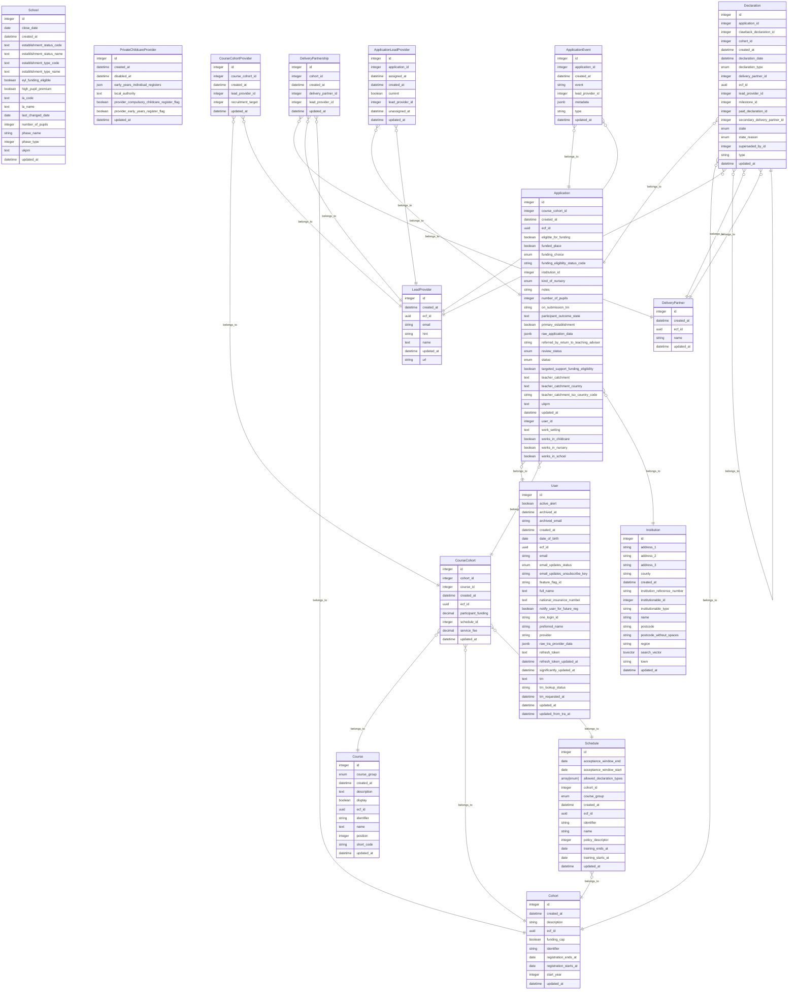

```mermaid
erDiagram
  School {
    integer id
    date close_date
    datetime created_at
    text establishment_status_code
    text establishment_status_name
    text establishment_type_code
    text establishment_type_name
    boolean eyl_funding_eligible
    boolean high_pupil_premium
    text la_code
    text la_name
    date last_changed_date
    integer number_of_pupils
    string phase_name
    integer phase_type
    text ukprn
    datetime updated_at
  }
  Schedule {
    integer id
    date acceptance_window_end
    date acceptance_window_start
    array[enum] allowed_declaration_types
    integer cohort_id
    enum course_group
    datetime created_at
    uuid ecf_id
    string identifier
    string name
    integer policy_descriptor
    date training_ends_at
    date training_starts_at
    datetime updated_at
  }
  Schedule }o--|| Cohort : belongs_to
  PrivateChildcareProvider {
    integer id
    datetime created_at
    datetime disabled_at
    json early_years_individual_registers
    text local_authority
    boolean provider_compulsory_childcare_register_flag
    boolean provider_early_years_register_flag
    datetime updated_at
  }
  LeadProvider {
    integer id
    datetime created_at
    uuid ecf_id
    string email
    string hint
    text name
    datetime updated_at
    string url
  }
  DeliveryPartnership {
    integer id
    integer cohort_id
    datetime created_at
    integer delivery_partner_id
    integer lead_provider_id
    datetime updated_at
  }
  DeliveryPartnership }o--|| DeliveryPartner : belongs_to
  DeliveryPartnership }o--|| LeadProvider : belongs_to
  DeliveryPartnership }o--|| Cohort : belongs_to
  DeliveryPartner {
    integer id
    datetime created_at
    uuid ecf_id
    string name
    datetime updated_at
  }
  CourseCohortProvider {
    integer id
    integer course_cohort_id
    datetime created_at
    integer lead_provider_id
    integer recruitment_target
    datetime updated_at
  }
  CourseCohortProvider }o--|| CourseCohort : belongs_to
  CourseCohortProvider }o--|| LeadProvider : belongs_to
  CourseCohort {
    integer id
    integer cohort_id
    integer course_id
    datetime created_at
    uuid ecf_id
    decimal participant_funding
    integer schedule_id
    decimal service_fee
    datetime updated_at
  }
  CourseCohort }o--|| Course : belongs_to
  CourseCohort }o--|| Cohort : belongs_to
  CourseCohort }o--|| Schedule : belongs_to
  Course {
    integer id
    enum course_group
    datetime created_at
    text description
    boolean display
    uuid ecf_id
    string identifier
    text name
    integer position
    string short_code
    datetime updated_at
  }
  Cohort {
    integer id
    datetime created_at
    string description
    uuid ecf_id
    boolean funding_cap
    string identifier
    date registration_ends_at
    date registration_starts_at
    integer start_year
    datetime updated_at
  }
  Declaration {
    integer id
    integer application_id
    integer clawback_declaration_id
    integer cohort_id
    datetime created_at
    datetime declaration_date
    enum declaration_type
    integer delivery_partner_id
    uuid ecf_id
    integer lead_provider_id
    integer milestone_id
    integer paid_declaration_id
    integer secondary_delivery_partner_id
    enum state
    enum state_reason
    integer superseded_by_id
    string type
    datetime updated_at
  }
  Declaration }o--|| Application : belongs_to
  Declaration }o--|| Cohort : belongs_to
  Declaration }o--|| LeadProvider : belongs_to
  Declaration }o--|| Declaration : belongs_to
  Declaration }o--|| DeliveryPartner : belongs_to
  Declaration }o--|| DeliveryPartner : belongs_to
  ApplicationLeadProvider {
    integer id
    integer application_id
    datetime assigned_at
    datetime created_at
    boolean current
    integer lead_provider_id
    datetime unassigned_at
    datetime updated_at
  }
  ApplicationLeadProvider }o--|| Application : belongs_to
  ApplicationLeadProvider }o--|| LeadProvider : belongs_to
  ApplicationEvent {
    integer id
    integer application_id
    datetime created_at
    string event
    integer lead_provider_id
    jsonb metadata
    string type
    datetime updated_at
  }
  ApplicationEvent }o--|| Application : belongs_to
  ApplicationEvent }o--|| LeadProvider : belongs_to
  Application {
    integer id
    integer course_cohort_id
    datetime created_at
    uuid ecf_id
    boolean eligible_for_funding
    boolean funded_place
    enum funding_choice
    string funding_eligiblity_status_code
    integer institution_id
    enum kind_of_nursery
    string notes
    integer number_of_pupils
    string on_submission_trn
    text participant_outcome_state
    boolean primary_establishment
    jsonb raw_application_data
    string referred_by_return_to_teaching_adviser
    enum review_status
    enum status
    boolean targeted_support_funding_eligibility
    text teacher_catchment
    text teacher_catchment_country
    string teacher_catchment_iso_country_code
    text ukprn
    datetime updated_at
    integer user_id
    text work_setting
    boolean works_in_childcare
    boolean works_in_nursery
    boolean works_in_school
  }
  Application }o--|| User : belongs_to
  Application }o--|| CourseCohort : belongs_to
  Application }o--|| Institution : belongs_to
  Institution {
    integer id
    string address_1
    string address_2
    string address_3
    string county
    datetime created_at
    string institution_reference_number
    integer institutionable_id
    string institutionable_type
    string name
    string postcode
    string postcode_without_spaces
    string region
    tsvector search_vector
    string town
    datetime updated_at
  }
  User {
    integer id
    boolean active_alert
    datetime archived_at
    string archived_email
    datetime created_at
    date date_of_birth
    uuid ecf_id
    string email
    enum email_updates_status
    string email_updates_unsubscribe_key
    string feature_flag_id
    text full_name
    text national_insurance_number
    boolean notify_user_for_future_reg
    string one_login_id
    string preferred_name
    string provider
    jsonb raw_tra_provider_data
    text refresh_token
    datetime refresh_token_updated_at
    datetime significantly_updated_at
    text trn
    string trn_lookup_status
    datetime trn_requested_at
    datetime updated_at
    datetime updated_from_tra_at
  }
```